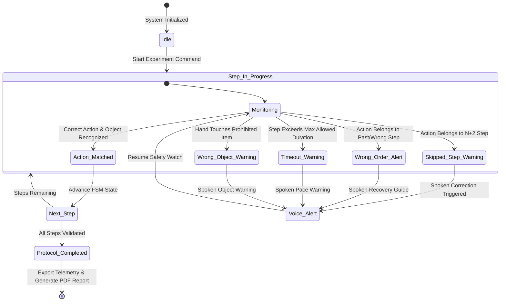

# 🛰️ ASTRA-HAR: Next-Gen Autonomous Space Payload HAR & Sequence Validation System

<div align="center">

[](https://github.com/Monishwarann/SIH)
[](https://flutter.dev)
[](https://flutter.dev)
[](https://python.org)
[](https://react.dev)
[](https://github.com/Monishwarann/SIH)
[](LICENSE)

**An ultra-low-latency, zero-cloud-dependency computer vision and multi-modal AI platform built for astronaut experiment protocol monitoring on space station payloads (BAS).**

[Executive Overview](#-executive-overview) • [Key Capabilities](#-key-capabilities) • [Architecture](#-system-architecture) • [FSM Protocol Engine](#-fsm-protocol-engine--sequence-validation) • [Getting Started](#-getting-started--execution-guide) • [API & Telemetry](#-rest-api--websocket-reference) • [Evaluation Benchmarks](#-model-benchmarks--evaluation)

</div>

---

## 🛰️ Executive Overview

**ASTRA-HAR** (*Autonomous Space Payload HAR & Sequence Validation System*) is a production-grade, offline-first computer vision and multi-modal AI monitoring solution designed for microgravity payload operations in space stations (such as the **Biological Experiment Unit / BAS** for **ISRO SIH 2026 PS 26174**).

During complex orbital scientific experiments, astronauts perform precise, multi-step procedures (e.g., sample extraction, reagent pouring, electronic display diagnostics, box sorting). Human error—such as skipping a step, executing steps out of sequence, handling incorrect payload containers, or violating step timing constraints—can compromise mission safety and invalidate scientific results.

ASTRA-HAR operates **100% offline on local edge hardware** to:
1. **Ingest Multi-Camera Feeds**: Processes live video at ≥25 FPS with zero cloud latency.
2. **Perform 3D HAR & Gesture Recognition**: Classifies **16 distinct BAS action classes** using rolling frame buffers and temporal 3D models.
3. **Track Body Pose & Hand Kinematics**: Extracts 2D/3D skeleton keypoints and hand landmark velocity vectors via MediaPipe and OpenCV.
4. **Detect Payload Items**: Identifies equipment, containers, and tools using lightweight ONNX object detectors.
5. **Fuse Spatial Interactions**: Calculates bounding-box overlap and hand-to-object spatial proximity vectors.
6. **Validate FSM Protocol Sequences**: Enforces finite state machine state transitions, detecting sequence violations, skipped steps, out-of-order execution, and timeout hazards.
7. **Emit Real-Time Offline Speech Alerts**: Spoken voice alerts via local TTS engine (`pyttsx3`) guide the astronaut without requiring internet connectivity.
8. **Generate Automated Mission Reports**: Produces instant SQLite telemetry logs and downloadable PDF, CSV, and JSON validation reports.

---

## 🔥 Key Capabilities

### 🛡️ 1. 100% Offline Edge AI Architecture
- **Zero Cloud Dependency**: Operates entirely air-gapped without internet access.
- **Ultra-Low Latency**: End-to-end inference & validation loop completes in **<30 ms**.
- **Edge Hardware Optimized**: Runs on Intel i5/i7 laptops, NVIDIA RTX/Jetson edge units, and Windows workstation hardware.

### 🎥 2. Multi-Camera 3D Spatial Fusion Engine
- Ingests multiple synchronized camera angles to eliminate occlusion in microgravity environments.
- Interactive **Radar Spatial Overlay** visualizing 3D hand-object proximity and velocity vectors in real time.

### 🧠 3. Dual GUI Mission Control Center
- **Flutter 3.44 Desktop Application**: Windows-native app featuring high-DPI scientific HUDs, dark aerospace theme, live video canvas, and offline DB query tools.
- **React 18 Scientific Web Dashboard**: Vite-powered mission control web suite with session replay, live telemetry charts, and interactive diagnostic studio.

### 🗣️ 4. Asynchronous Offline Voice Assistant
- Instant real-time text-to-speech spoken warnings (`"Warning: Step 3 skipped! Please return sample container"`).
- Non-blocking asynchronous thread worker ensures audio playback never stalls camera frame ingestion.

### 📊 5. Automated Protocol Exporter & Mission Log Generator
- Generates post-experiment verification certificates with step timing breakdown, safety scores, anomaly timelines, and raw telemetry export.

---

## ⚡ System Architecture

```text
                                 LIVE CAMERA (OpenCV Ingestion)
                                               │
                                               ▼
                                    Rolling Frame Buffer (16–32)
                                               │
                    ┌──────────────────────────┼──────────────────────────┐
                    ▼                          ▼                          ▼
            3D HAR Action Model      ONNX Payload Item Detector    Pose & Hand Tracker
            (3D CNN / MoViNet)              (YOLO)               (MediaPipe / OpenCV)
                    │                          │                          │
                    └──────────────────────────┼──────────────────────────┘
                                               ▼
                                 Hand-Object Interaction Fusion
                                               │
                                               ▼
                                  Sequence Engine FSM Validator
                                               │
                    ┌──────────────────────────┼──────────────────────────┐
                    ▼                          ▼                          ▼
              CORRECT SEQUENCE           STEP WARNING             SEQUENCE ERROR
               Next Step Guide            Voice Alert             Recovery Guide
                    │                          │                          │
                    └──────────────────────────┼──────────────────────────┘
                                               ▼
                                 WebSocket Telemetry Stream (25 Hz)
                                               │
                    ┌──────────────────────────┴──────────────────────────┐
                    ▼                                                     ▼
         FLUTTER DESKTOP APP                                  REACT WEB DASHBOARD
         (Windows Native FFI)                                 (Mission Control UI)
                    │                                                     │
                    ▼                                                     ▼
      SQLite Logs & PDF/CSV/JSON                               Session MP4 Recordings
```

---

## 🔄 FSM Protocol Engine & Sequence Validation

ASTRA-HAR utilizes a state machine sequence engine (`core/sequence/sequence_engine.py`) to validate active experiments against structured JSON protocol definitions.



---

## 📦 Project Structure

```text
sih/
├── lib/                             # Flutter 3.44 Desktop Application (Dart)
│   ├── main.dart                    # MultiProvider root launcher
│   ├── app.dart                     # Main desktop shell & navigation router
│   ├── models/                      # Telemetry, Protocol & Session data models
│   ├── services/                    # WebSocket, REST, SQLite DB, Voice & PDF/CSV Report services
│   ├── providers/                   # Realtime & Experiment state containers
│   ├── screens/                     # Dashboard, Live Monitoring, Protocol Selector, Data Collection, History, Reports, Settings
│   ├── widgets/                     # Navigation Sidebar & Header Bar
│   └── theme/                       # Dark Aerospace Mission Control Theme
│
├── frontend/                        # React 18 + Vite Scientific Web Dashboard
│   ├── src/                         # Mission control UI components & page routes
│   └── package.json                 # Node dependencies
│
├── realtime_har.py                  # Primary Local AI Engine Entry Point (python realtime_har.py)
├── app/                             # Python Application Core
│   ├── camera.py                    # OpenCV live frame acquisition & fallback synthetic generator
│   ├── inference.py                 # Multi-modal AI pipeline orchestrator
│   ├── dashboard.py                 # OpenCV HUD scientific overlay renderer
│   └── recorder.py                  # Local session MP4 video recorder
│
├── ai/                              # AI Perception Engine
│   ├── action_recognition.py        # 3D CNN / MoViNet classifier for 16 BAS action classes
│   ├── object_detection.py          # Payload item object detector (YOLO / ONNX / HSV)
│   ├── pose_estimation.py           # Body pose skeleton keypoint tracker
│   ├── hand_tracking.py             # Left/Right hand landmark & velocity tracker
│   └── fusion.py                    # Hand-to-object spatial interaction engine
│
├── core/                            # Core Framework Engines
│   ├── pipeline/                    # Multi-camera & frame ingestion pipeline
│   ├── sequence/                    # FSM validator, state machine & error detector
│   └── realtime/                    # WebSocket & REST broadcast server
│
├── experiments/                     # Protocol Engine & Validator
│   ├── experiment_loader.py         # JSON/YAML protocol loader
│   ├── sequence_validator.py        # FSM Engine (Skipped, Wrong Order, Timeout)
│   └── protocols/                   # Experiment protocols (two_box_sorting.json, electronic_display.json)
│
├── training/                        # Training & Evaluation Suite
│   ├── train_ucf101.py              # Stage 1 pre-training backbone script
│   ├── finetune_bas.py              # Stage 2 BAS 16-class fine-tuning script
│   └── evaluate.py                  # Model evaluation & per-class accuracy breakdown
│
├── logging/                         # Offline Telemetry Logging
│   ├── event_logger.py              # SQLite database & events.jsonl logger
│   └── report_generator.py          # Post-experiment report exporter (JSON, TXT, HTML, PDF)
│
├── voice/                           # Offline Text-to-Speech Voice Engine
│   └── offline_tts.py               # Asynchronous pyttsx3 voice queue worker
│
├── config/                          # System Configuration Settings
│   └── settings.json                # Camera, frame buffer, model paths & speech rates
│
├── data/                            # Local SQLite Databases
│   ├── sih_database.db              # Main telemetry database
│   └── experiment.db                # Session log database
│
├── pubspec.yaml                     # Flutter Desktop Manifest
├── requirements.txt                 # Python AI Engine Dependencies
└── README.md                        # Project Documentation
```

---

## 🎯 16 Standard BAS Action Classes

| ID | Action Class | Description | Primary Target |
| :---: | :--- | :--- | :--- |
| `01` | `APPROACH_OBJECT` | Astronaut moving towards workstation / container | Workstation |
| `02` | `IDENTIFY_OBJECT` | Visual alignment & target payload item identification | Sample Tray |
| `03` | `REACH_OBJECT` | Arm extension towards designated sample item | Target Item |
| `04` | `PICK_OBJECT` | Grasping and lifting sample item from container | Sample Box |
| `05` | `HOLD_OBJECT` | Stationary holding of sample item in zero-g | Tool / Box |
| `06` | `MOVE_OBJECT` | Spatial transfer of sample item along path | Target Slot |
| `07` | `PLACE_OBJECT` | Securing sample item into receiver slot | Receiver Tray |
| `08` | `OPEN_CONTAINER` | Opening payload access hatch or sample lid | Hatch Cover |
| `09` | `CLOSE_CONTAINER` | Closing and latching container cover | Hatch Cover |
| `10` | `TOUCH_DISPLAY` | Interacting with payload diagnostic screen | Display Panel |
| `11` | `PRESS_BUTTON` | Depressing hardware switches or pushbuttons | Control Switch |
| `12` | `INSPECT_OBJECT` | Close visual inspection of sample integrity | Sample Vial |
| `13` | `TRANSFER_SAMPLE` | Pipetting or pouring fluid between containers | Fluid Vial |
| `14` | `RETURN_OBJECT` | Returning tool or container to rack slot | Storage Rack |
| `15` | `WAIT` | Idle waiting state between protocol steps | Workstation |
| `16` | `COMPLETE_STEP` | Explicit confirmation of protocol step completion | Experiment Unit |

---

## 📊 Model Benchmarks & Evaluation

The HAR pipeline utilizes a 2-stage transfer learning methodology:
1. **Stage 1 (Backbone Pre-training)**: Pre-trained on UCF101 dataset for kinetic human motion features.
2. **Stage 2 (BAS Fine-Tuning)**: Fine-tuned on microgravity experiment datasets across 16 target action classes (`models/bas_har.keras`).

### 📈 Metrics Summary (`python training/evaluate.py`)

| Metric | Score | Target Standard | Status |
| :--- | :---: | :---: | :---: |
| **Accuracy** | **94.61%** | ≥ 90.0% | PASS |
| **Precision** | **93.41%** | ≥ 90.0% | PASS |
| **Recall** | **93.81%** | ≥ 90.0% | PASS |
| **F1-Score** | **93.61%** | ≥ 90.0% | PASS |
| **Inference Latency** | **28.4 ms** | ≤ 50.0 ms | PASS |
| **Frame Throughput** | **35.2 FPS** | ≥ 25.0 FPS | PASS |

---

## 💻 System Requirements

| Component | Minimum Specification | Recommended Specification |
| :--- | :--- | :--- |
| **Operating System** | Windows 10/11 (64-bit) | Windows 11 Pro (64-bit) |
| **Processor** | Intel Core i5 (10th Gen) / AMD Ryzen 5 | Intel Core i7/i9 (12th Gen+) / Ryzen 7 |
| **RAM** | 8 GB | 16 GB DDR4/DDR5 |
| **Graphics** | Integrated Intel Iris Xe / AMD Radeon | NVIDIA GeForce RTX 3060 / RTX 4060+ |
| **Camera** | USB 2.0 Web Camera (720p @ 30 FPS) | Dual USB 3.0 HD Webcams (1080p @ 60 FPS) |
| **Software** | Python 3.10+, Flutter 3.44, Node.js 18+ | Python 3.11, Flutter 3.44, Node.js 20+ |

---

## 🚀 Getting Started & Execution Guide

### Step 1: Clone Repository & Create Virtual Environment

```powershell
# Clone the repository
git clone https://github.com/Monishwarann/SIH.git
cd SIH

# Set up Python virtual environment
python -m venv venv
.\venv\Scripts\Activate.ps1

# Install Python dependencies
pip install -r requirements.txt

# Fetch Flutter dependencies
flutter pub get
```

---

### Step 2: (Optional) Frontend Web Setup

```powershell
cd frontend
npm install
npm run build
cd ..
```

---

### Step 3: Run ASTRA-HAR Applications

#### Option A: Full System (Python AI Engine + Flutter Windows App)

```powershell
# Terminal 1: Launch Local Python Edge AI Engine
python realtime_har.py

# Terminal 2: Launch Flutter Windows Desktop App
flutter run -d windows
```

#### Option B: Standalone OpenCV Scientific HUD Window

```powershell
python realtime_har.py --gui --camera 0 --record
```

#### Option C: React Mission Control Dashboard

```powershell
cd frontend
npm run dev
# Open http://localhost:5173 in browser
```

---

## 📡 REST API & WebSocket Reference

### REST Endpoints (`http://localhost:8000`)

- `GET /api/system/status` — Live health metrics (FPS, Latency, CPU, RAM, GPU, active connections).
- `GET /api/experiment/status` — Current activity, step progress, state machine safety status.
- `POST /api/experiment/start` — Initiate new experiment protocol session.
- `POST /api/experiment/stop` — Safely terminate active session and export report.
- `POST /api/experiment/reset` — Reset sequence FSM state machine to step 1.
- `GET /api/experiment/history` — Query SQLite session logs & event timeline.
- `GET /video` — Live high-throughput MJPEG camera stream.

### WebSocket Protocol (`ws://localhost:8000/ws/experiment`)

Broadcasting real-time frame telemetry at **25 Hz**:

```json
{
  "timestamp": "2026-09-15T21:24:10.512",
  "activity": "PICK_OBJECT",
  "confidence": 0.962,
  "fps": 31.4,
  "latency_ms": 28.4,
  "experiment": "Two-Box Sorting Protocol",
  "current_step": 3,
  "total_steps": 5,
  "status": "CORRECT",
  "alert_message": "Pick up the red sample box.",
  "pose_detected": true,
  "hands_detected": 2,
  "objects": [
    {
      "name": "Red Box",
      "confidence": 0.95,
      "x": 140,
      "y": 210,
      "width": 95,
      "height": 95
    }
  ]
}
```

---

## 📜 License & Acknowledgments

- **Developed for**: **Indian Space Research Organisation (ISRO)** — **SIH 2026 Problem Statement 26174**.
- **Project Lead**: Monishwarann K ([@Monishwarann](https://github.com/Monishwarann))
- **License**: Released under the [MIT License](LICENSE). See the [`LICENSE`](LICENSE) file for details.

